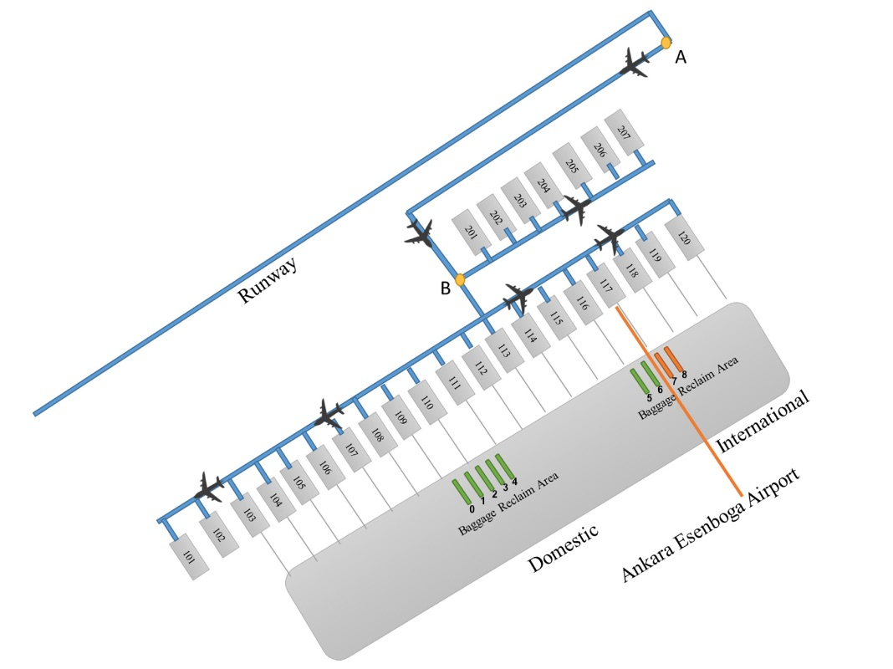
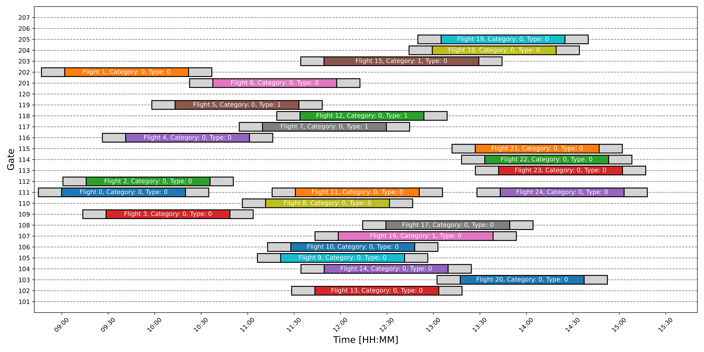

# Airport Gate Assignment Optimization

## Overview
This project focuses on optimizing airport gate assignments using a Mixed-Integer Linear Programming (MILP) approach. It balances two critical objectives:
1. Minimizing the total fuel consumption of aircraft during taxi operations.
2. Minimizing the total walking distance for passengers from gates to baggage carousels.

The model was tested with realistic flight schedules at the apron of Ankara Esenboga Airport and demonstrated robustness and effectiveness in achieving its goals.

Full description of the project can be found in the provided Operations.pdf file.

### Features
- Joint optimization of multiple objectives for operational efficiency and passenger comfort.
- Mathematical model implemented using the Gurobi optimization package in Python.
- Includes sensitivity analysis for parameters such as buffer times, taxi speeds, and objective weighting.

### Investigated Parameters

##### Flight Parameters
- Flight Arrival Time
- Aircraft Performance Category
  - Narrow-Body 
  - Wide-Body 
- Flight Operational Type 
  - Domestic
  - International
- Speed of the aircraft during taxiing
- Rate of fuel consumption per second, based on the aircraft’s performance category
- Average time an aircraft spends at the gate, based on its performance category
- Additional time added to account for flight delays

##### Gate Parameters
- The distance from the gate to the runway.
- Aircraft performance compatibility, indicating whether a gate can service aircraft of a certain performance category.
- Operational compatibility, indicating whether a gate can service aircraft of a certain operational type.

##### Baggage Carousel Parameters
- Compatibility with Gate, indicating if a carousel is compatible with a certain gate.
- Distance from baggage carousel to gate.

### Prerequisites
- Python 3.x
- Gurobi Optimization package
- Required Python packages listed in `requirements.txt`

### File Structure
- `data.xlsx`: Contains flight, gate, and baggage carousel data.
- `model.py`: Defines the MILP model and solves optimization problems.
- `data_processing.py`: Generates flight schedules and preprocesses input data.
- `utils.py`: Contains helper functions for visualization and data management.
- `config.yaml`: Configurable parameters for the optimization problems.

### Results
- The project verified the correctness of the mathematical model through validation tests.
- Conducted sensitivity analysis for robustness against changes in key parameters.
- Optimized real-world flight schedules, demonstrating the model's practical applicability as shown in the example schedule consisting of 25 flights.

### Acknowledgments
- Developed as part of the AE4441-16 Operations Optimization course at TU Delft.
- Based on the MILP framework proposed by Cecen et al. (2021).
- Supervisors: Ir. P.C. Roling and A. Bombelli.

### References 
1. Cecen, R. K. Multi-objective optimization model for airport gate assignment problem. Aircraft Engineering and Aerospace Technology, 2021.
2. Gurobi Optimization, LLC. Gurobi Optimizer Reference Manual, 2023.
